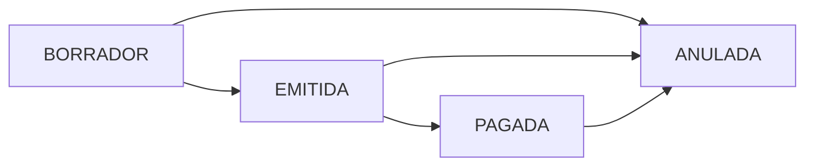

# Validación de Flujo: Generación y Emisión de Facturas

## Resumen

Se ha implementado la funcionalidad completa para generar snapshots y emitir facturas en el Admin Hub, siguiendo el flujo de estados BORRADOR → EMITIDA → PAGADA / ANULADA.

---

## Flujo de Estados

### Estados Disponibles

| Estado | Descripción | Acciones Permitidas |
|--------|-------------|---------------------|
| `BORRADOR` | Snapshot generado pero no emitido | Regenerar, Emitir, Anular |
| `EMITIDA` | Factura emitida y registrada | Marcar como Pagada, Anular |
| `PAGADA` | Factura pagada por el cliente | Anular (solo en casos especiales) |
| `ANULADA` | Factura anulada | Ninguna (estado final) |

### Transiciones Permitidas



| Desde | A | Descripción |
|-------|---|-------------|
| BORRADOR | EMITIDA | Emitir factura (genera snapshot + cambia estado) |
| BORRADOR | ANULADA | Cancelar factura sin emitir |
| EMITIDA | PAGADA | Marcar factura como pagada |
| EMITIDA | ANULADA | Anular factura emitida |
| PAGADA | ANULADA | Anular factura pagada (casos especiales) |

---

## Endpoints Backend

### 1. Generar Snapshot
```
POST /api/billing-summary/facturacion/:empresaId/:periodo/snapshot
```
**Descripción**: Congela los valores actuales de facturación en una tabla histórica

**Comportamiento**:
- Si NO existe snapshot → Lo crea en estado BORRADOR
- Si existe en BORRADOR → Lo regenera (actualiza valores)
- Si existe en EMITIDA/PAGADA → Error 409 (no puede regenerarse)

**Response**:
- `201`: Snapshot creado exitosamente
- `200`: Snapshot regenerado exitosamente
- `409`: Ya está emitido o pagado (no puede regenerarse)

### 2. Actualizar Estado
```
PATCH /api/billing-summary/facturacion/:empresaId/:periodo/snapshot/estado
Body: { estado: "EMITIDA" | "PAGADA" | "ANULADA" }
```
**Descripción**: Actualiza el estado del snapshot

**Validaciones**:
- Verifica transiciones permitidas
- Rechaza transiciones inválidas con error 409

**Response**:
- `200`: Estado actualizado exitosamente
- `404`: Snapshot no encontrado
- `409`: Transición de estado no permitida

---

## Actions Frontend

### 1. `generateInvoiceSnapshot(empresaId, period)`
Genera o regenera el snapshot de una factura

```typescript
const result = await generateInvoiceSnapshot(empresaId, "Enero 2026");
// result.success: boolean
// result.message: string
```

### 2. `updateInvoiceStatus(empresaId, period, estado)`
Actualiza el estado de una factura

```typescript
const result = await updateInvoiceStatus(empresaId, "Enero 2026", "EMITIDA");
```

### 3. `emitInvoice(empresaId, period)`
Emite una factura (genera snapshot + cambia estado a EMITIDA)

```typescript
const result = await emitInvoice(empresaId, "Enero 2026");
```

### 4. `markInvoiceAsPaid(empresaId, period)`
Marca una factura como pagada

```typescript
const result = await markInvoiceAsPaid(empresaId, "Enero 2026");
```

### 5. `cancelInvoice(empresaId, period)`
Anula una factura

```typescript
const result = await cancelInvoice(empresaId, "Enero 2026");
```

---

## Validaciones Implementadas

### CA-1: Generar Snapshot ✅
**Given**: Factura en borrador  
**When**: Genero snapshot  
**Then**: Se crea o actualiza snapshot

**Implementación**:
- `POST /billing-summary/facturacion/:empresaId/:periodo/snapshot`
- Crea nuevo snapshot o regenera si está en BORRADOR
- Bloquea regeneración si está EMITIDA o PAGADA

### CA-2: Emitir Factura ✅
**Given**: Todos los items están aprobados  
**When**: Intento emitir  
**Then**: Estado cambia a EMITIDA

**Implementación**:
```typescript
const allItemsApproved = useMemo(
  () =>
    invoiceLineItems.length > 0 &&
    invoiceLineItems.every((item) => item.status === "Aprobado"),
  [invoiceLineItems]
);
```
- Validación en frontend antes de mostrar modal
- Action `emitInvoice()` genera snapshot + actualiza estado

### CA-3: Bloqueo por Items Pendientes ✅
**Given**: Hay items pendientes de aprobación  
**When**: Intento emitir  
**Then**: Muestra mensaje de bloqueo

**Implementación**:
```typescript
function handleEmitInvoiceClick() {
  if (allItemsApproved) {
    setEmitModal("confirm-emit");
  } else {
    setEmitModal("cannot-emit");
  }
}
```
- Modal con mensaje: "Todos los cargos y ajustes deben estar aprobados antes de emitir la factura"
- No permite continuar hasta aprobar todos los items

### CA-4: Marcar Como Pagada ✅
**Given**: Factura está emitida  
**When**: Marco como pagada  
**Then**: Estado cambia a PAGADA

**Implementación**:
- Action `markInvoiceAsPaid()` disponible
- Transición EMITIDA → PAGADA permitida por backend

---

## Componentes Modificados

### 1. `invoice.types.ts`
✅ Agregado campo `empresaId` al interface `Invoice`
```typescript
export interface Invoice {
  id: string;
  clientId: string;
  empresaId: string;  // NUEVO
  client: string;
  period: string;
  totalAmount: string;
  status: InvoiceStatus;
}
```

### 2. `pagos.actions.ts`
✅ Agregadas 5 nuevas functions:
- `generateInvoiceSnapshot()`
- `updateInvoiceStatus()`
- `emitInvoice()`
- `markInvoiceAsPaid()`
- `cancelInvoice()`
- Helper: `displayPeriodToApiPeriod()` para convertir formato de periodo

### 3. `InvoiceDetailContent.tsx`
✅ Actualizado para emitir facturas:
- Validación de items aprobados (`allItemsApproved`)
- Estado de carga (`isEmitting`)
- Llamada a `emitInvoice()` en confirmación
- Refresh automático después de emitir

### 4. `InvoiceEmitModal.tsx`
✅ Agregado soporte para loading:
- Prop `isLoading` opcional
- Deshabilita botones durante emisión
- Muestra "Procesando..." en botón primario

---

## Conversión de Períodos

El frontend usa períodos en formato display ("Enero 2026"), mientras que el backend usa formato ISO ("2026-01").

### Función de Conversión
```typescript
function displayPeriodToApiPeriod(displayPeriod: string): string {
  const [monthName, yearStr] = displayPeriod.split(" ");
  const monthIndex = NOMINA_MONTH_NAMES.indexOf(monthName);
  const mes = (monthIndex + 1).toString().padStart(2, "0");
  return `${yearStr}-${mes}`;
}
```

### Ejemplos
| Display | API |
|---------|-----|
| "Enero 2026" | "2026-01" |
| "Diciembre 2025" | "2025-12" |

---

## Flujo de Usuario

### Emisión de Factura

1. **Usuario accede al detalle de factura**
   - `GET /admin-hub/facturas/:id`
   - Muestra todos los items, nóminas, cargos y créditos

2. **Usuario revisa y aprueba items**
   - Aprueba/rechaza cada item pendiente
   - Sistema valida que todos estén aprobados

3. **Usuario hace clic en "Emitir Invoice"**
   - Si hay items pendientes → Modal de bloqueo
   - Si todos aprobados → Modal de confirmación

4. **Usuario confirma emisión**
   - Frontend: `emitInvoice(empresaId, period)`
   - Backend: Genera snapshot → Cambia estado a EMITIDA
   - Notificación de éxito
   - Refresco automático de la página

### Marcar Como Pagada (Futura Implementación)

1. **Factura en estado EMITIDA**
2. **Botón "Marcar como Pagada"** (por implementar en UI)
3. **Confirmación del usuario**
4. **Backend**: Actualiza estado a PAGADA
5. **Notificación y actualización de vista**

---

## Estados de Loading

### Durante Emisión
- Botón "Emitir Invoice" → "Emitiendo..."
- Botón deshabilitado
- Modal con botones deshabilitados y texto "Procesando..."
- No se puede cerrar el modal durante la emisión

### Después de Emisión
- Notificación de éxito/error
- Router refresh para actualizar datos
- Modal se cierra automáticamente

---

## Manejo de Errores

### Errores Comunes

| Error | Código | Mensaje | Solución |
|-------|--------|---------|----------|
| Snapshot ya emitido | 409 | "La factura ya está emitida o pagada y no puede regenerarse" | Validar estado antes |
| Transición inválida | 409 | "Transición de estado no permitida" | Verificar flujo de estados |
| Factura no encontrada | 404 | "Factura no encontrada" | Verificar IDs |
| Periodo inválido | 400 | "Formato de periodo inválido" | Usar formato YYYY-MM |

### Mensajes de Usuario

```typescript
// Éxito
addNotification("La factura fue emitida correctamente.", "success");

// Error
addNotification(result.message || "Error al emitir la factura", "error");
```

---

## Testing

### Casos de Prueba Manuales

#### 1. Emitir Factura con Items Aprobados
- [ ] Todos los items están aprobados
- [ ] Click en "Emitir Invoice"
- [ ] Se muestra modal de confirmación
- [ ] Al confirmar, factura se emite correctamente
- [ ] Notificación de éxito aparece
- [ ] Página se actualiza automáticamente

#### 2. Intentar Emitir con Items Pendientes
- [ ] Al menos un item está pendiente
- [ ] Click en "Emitir Invoice"
- [ ] Se muestra modal de bloqueo
- [ ] No se puede continuar hasta aprobar todos

#### 3. Regenerar Snapshot en Borrador
- [ ] Factura está en BORRADOR
- [ ] Se pueden hacer cambios a items
- [ ] Se puede regenerar snapshot
- [ ] Valores se actualizan correctamente

#### 4. Bloqueo de Regeneración
- [ ] Factura está en EMITIDA
- [ ] Intentar regenerar snapshot
- [ ] Error 409: No puede regenerarse
- [ ] Mensaje de error apropiado

---

## Próximas Mejoras

1. **Botón "Marcar como Pagada"**
   - Agregar botón en el detalle de factura emitida
   - Modal de confirmación
   - Integración con `markInvoiceAsPaid()`

2. **Botón "Anular Factura"**
   - Disponible para facturas en cualquier estado
   - Modal con razón de anulación
   - Integración con `cancelInvoice()`

3. **Historial de Estados**
   - Mostrar timeline de cambios de estado
   - Quién y cuándo se hizo cada cambio

4. **Vista de Snapshot**
   - Mostrar snapshot congelado vs. valores actuales
   - Comparación lado a lado

5. **Validaciones Adicionales**
   - Validar montos mínimos/máximos
   - Verificar información del cliente completa
   - Alertas antes de emitir

---

## Resumen de Validación

| Criterio | Estado | Implementación |
|----------|--------|----------------|
| CA-1: Generar snapshot | ✅ | `generateInvoiceSnapshot()` |
| CA-2: Emitir con items aprobados | ✅ | `emitInvoice()` + validación |
| CA-3: Bloqueo items pendientes | ✅ | Modal de bloqueo |
| CA-4: Marcar como pagada | ✅ | `markInvoiceAsPaid()` |
| Flujo BORRADOR→EMITIDA | ✅ | Completo |
| Flujo EMITIDA→PAGADA | ✅ | Backend listo, UI pendiente |
| Manejo de errores | ✅ | Try/catch + notificaciones |
| Estados de loading | ✅ | isEmitting + UI feedback |

**Estado General**: ✅ **COMPLETADO Y FUNCIONAL**

La funcionalidad core está implementada y lista para pruebas. Los botones adicionales (Marcar como Pagada, Anular) pueden agregarse según necesidad del usuario.
