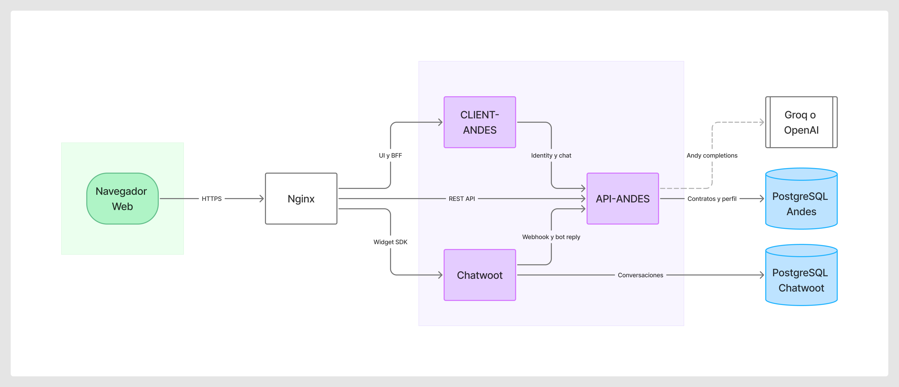
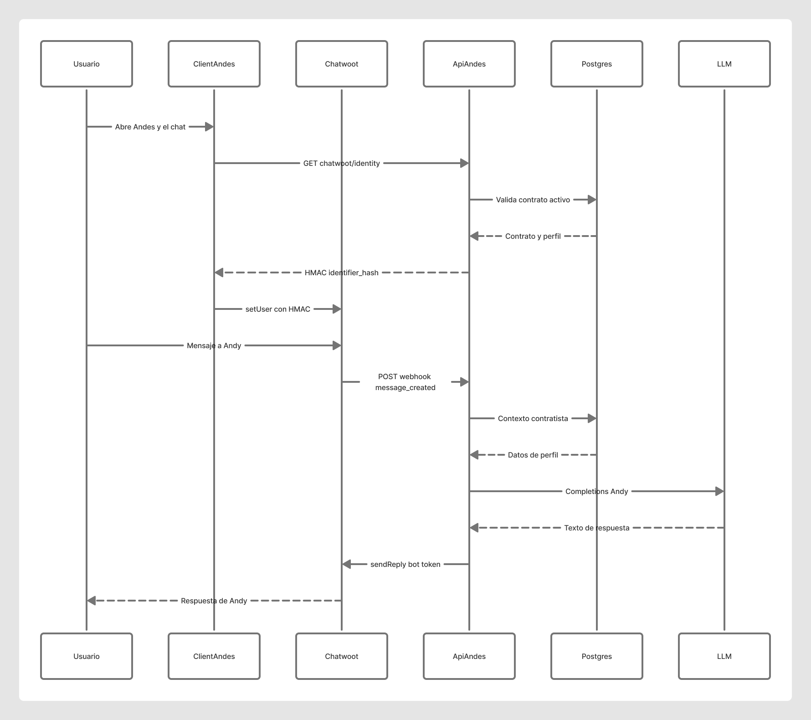

# Diagramas — Andy, CLIENT y API

Tablero FigJam (editable): [Arquitectura Andy CLIENT + API](https://www.figma.com/board/U5q4W4fLN7rianGb83y3yM)

Exportados el 8 de septiembre de 2026.

---

## 1. Arquitectura

**Archivo:** `arquitectura-andy-client-api.png`

Lectura izquierda → derecha:

1. Navegador → Nginx / Traefik  
2. CLIENT-ANDES (UI + BFF identity/chat)  
3. Chatwoot (widget + conversaciones)  
4. API-ANDES (contratos, Andy, webhook)  
5. PostgreSQL Andes / PostgreSQL Chatwoot  
6. Groq u OpenAI (solo si no hay respuesta estática)

---

## 2. Secuencia de un mensaje (camino Chatwoot)

**Archivo:** `flujo-mensaje-andy-chatwoot.png`

Es el camino **principal**. El de reserva (contratista, Chatwoot caído) es `ChatWidget` → `POST /api/chat` y no pasa por Chatwoot.

---

## Cómo regenerar

En Cursor, con el MCP de Figma: `generate_diagram` (arquitectura + secuencia). Plan Figma: equipo Andes Workforce. Export: `download_assets` de las secciones `Arquitectura Andy CLIENT API` y `Flujo de mensaje Andy Chatwoot`.
