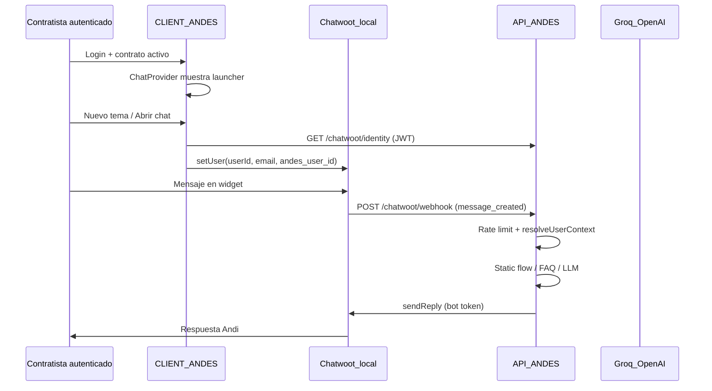

# Contexto técnico — Andi (Chatwoot + FAQ) · Fase 1 completada · Roadmap Fase 2

**Fecha:** 22 de julio de 2026  
**Estado Fase 1:** Implementado y probado en local  
**Rama de trabajo:** `feat/chatwoot-faq-bot` (API-ANDES + CLIENT-ANDES)  
**Documento relacionado:** [PLAN_CHATBOT_FAQ_ANDES.md](./PLAN_CHATBOT_FAQ_ANDES.md) (plan original MVP público)

---

## Resumen ejecutivo

La Fase 1 evolucionó el plan original de “FAQ público sin login” hacia **Andi**, un asistente integrado con **Chatwoot self-hosted** para **contratistas autenticados con contrato activo**. El bot conoce:

- Identidad del contratista (nombre, email, userId desde BD).
- Contexto dinámico de perfil y contrato activo.
- Flujos operativos (invoice, comprobantes Colombia, perfil, documentos).
- Conocimiento público de Andes (servicios, about, contacto) vía archivos `.md` sincronizados desde CLIENT-ANDES.

**PRs de referencia:** API #76 · CLIENT #225  
**Commits clave (jul 2026):** API `66b9a39` · CLIENT `2ae02df`

---

## Arquitectura actual



### Capas de respuesta (API `ChatService`)

| Orden | Capa | Cuándo | Costo tokens |
|-------|------|--------|--------------|
| 1 | Identidad (`matchIdentityQuestion`) | “¿cuál es mi nombre?” | 0 |
| 2 | Saludo personalizado | Solo saludo puro (sin “invoice”, “ayuda”, etc.) | 0 |
| 3 | Flujo estático contratista | invoice, seguridad social, perfil, contrato, pagos | 0 |
| 4 | FAQ estática pública | Solo visitantes anónimos | 0 |
| 5 | LLM | Resto de consultas con contexto | API Groq/OpenAI |

---

## Stack local de desarrollo

| Servicio | Puerto | Repo / carpeta |
|----------|--------|----------------|
| CLIENT-ANDES | 3000 | Next.js |
| API-ANDES | 8001 | NestJS |
| Chatwoot | 3030 | `CHATWOOT-LOCAL/` (Docker) |
| PostgreSQL Chatwoot | interno | Docker |

### Comandos habituales

```powershell
# Chatwoot
cd CHATWOOT-LOCAL
docker compose up -d

# API
cd API-ANDES
pnpm start:dev

# Client
cd CLIENT-ANDES
pnpm dev

# Sincronizar knowledge base desde páginas del CLIENT
cd API-ANDES
pnpm sync:chat-knowledge
```

---

## Acceso al chat (CLIENT)

Solo usuarios con **contrato activo**:

- Hook: `CLIENT-ANDES/src/components/chat/useChatAccess.ts`
- Provider: `ChatProvider.tsx` (no renderiza widget sin acceso)
- API: `POST /chat` y endpoints Chatwoot exigen JWT + `getCurrentContract()`

**Roles excluidos del widget actual:** visitantes anónimos, EMPRESA, ADMIN (no hay launcher para ellos en esta fase).

---

## Identidad del contratista (sin registro manual en Chatwoot)

### Cliente (widget)

| Archivo | Responsabilidad |
|---------|-----------------|
| `chatwoot-sdk.ts` | `setUser`, `ensureChatwootIdentity`, `startNewChatwootSession` |
| `ChatwootWidget.tsx` | Menú launcher, sync identidad antes de abrir chat |
| `app/api/chatwoot/identity/route.ts` | Proxy JWT → API |

`setUser` envía:

```typescript
api.setUser(String(user.id), {
  email: user.correo,
  name: buildFirstName(user),
  custom_attributes: { andes_user_id: String(user.id) },
});
```

**Importante:** Tras `reset()` (nuevo tema), siempre volver a llamar `setUser`.

### API (webhook)

| Archivo | Responsabilidad |
|---------|-----------------|
| `chatwoot.service.ts` | `resolveUserContext`, webhook, `sendReply` |
| `contractor-context.service.ts` | Bloque de contexto desde Prisma |
| `chat-user-context.ts` | Sanitización, nombres anónimos Chatwoot |

Orden de resolución de identidad en webhook:

1. `payload.sender`, `conversation.meta.sender`, `contact`
2. GET conversación + contacto completo (si hay `CHATWOOT_API_TOKEN`)
3. Resolución por email → `userId` en BD

### Sync server-side de contactos (opcional)

`syncContactForUser` en `GET /chatwoot/identity` **requiere** `CHATWOOT_API_TOKEN` (token de agente/admin).  
Sin ese token: **no falla**; la identidad la maneja el widget con `setUser`.

Error conocido evitado: `401 Access to this endpoint is not authorized for bots` — no usar `CHATWOOT_BOT_TOKEN` para crear contactos.

---

## Base de conocimiento (`.md` persistente)

| Archivo | Contenido |
|---------|-----------|
| `API-ANDES/src/chat/knowledge/andes-public-knowledge.md` | Páginas públicas (home, about, services, contact, blog, team, privacy) |
| `API-ANDES/src/chat/knowledge/andes-contractor-flows.md` | FAQ contratista, perfil, contrato, offers, bonifications |

**Script de sincronización:** `API-ANDES/scripts/sync-chat-knowledge.mjs`  
**Comando:** `pnpm sync:chat-knowledge`  
**Excluye:** rutas `/admin/**`

**Carga en runtime:** `KnowledgeBaseService` — recorta automáticamente el prompt del LLM (~36k contratista / ~28k público) manteniendo el `.md` completo en disco.

---

## Contexto dinámico del contratista

`ContractorContextService.buildContextBlock()` incluye:

- Identidad, perfil, campos pendientes, documentos subidos/pendientes
- Requisitos técnicos, banco/DollarApp
- Contrato activo: empresa, puesto, salario, documentos leídos, anexos, comprobantes mensuales

**Flujos estáticos** (`contractor-flow-matcher.ts`): respuestas inmediatas para invoice, seguridad social, perfil, contrato y pagos — evitan LLM y handoff innecesario.

---

## Rate limiting (anti-colapso)

Implementado en `ChatRateLimitService` (memoria del proceso API).

| Variable | Default | Alcance |
|----------|---------|---------|
| `CHAT_RATE_LIMIT_TTL` | 60000 ms | Ventana de sesión |
| `CHAT_RATE_LIMIT_LIMIT` | 15 | Mensajes por usuario en ventana |
| `CHAT_RATE_LIMIT_DAILY_LIMIT` | 100 | Mensajes por usuario / día UTC |
| `CHAT_RATE_LIMIT_CONVERSATION_LIMIT` | 10 | Mensajes por conversación Chatwoot en ventana |

- **Webhook Chatwoot:** mensaje amable en widget, sin LLM ni handoff.
- **`POST /chat`:** HTTP 429.

**Limitación Fase 1:** contadores en memoria — con **múltiples réplicas** del API no se comparten. Fase 2: Redis.

---

## Variables de entorno

### API-ANDES (`.env`)

```env
# Chat / LLM
CHAT_ENABLED=true
CHAT_PROVIDER=groq
CHAT_API_KEY=...
CHAT_MODEL=llama-3.1-8b-instant
CHAT_MAX_TOKENS=250

# Rate limit
CHAT_RATE_LIMIT_TTL=60000
CHAT_RATE_LIMIT_LIMIT=15
CHAT_RATE_LIMIT_DAILY_LIMIT=100
CHAT_RATE_LIMIT_CONVERSATION_LIMIT=10

# Chatwoot
CHATWOOT_ENABLED=true
CHATWOOT_BASE_URL=http://localhost:3030
CHATWOOT_ACCOUNT_ID=1
CHATWOOT_BOT_TOKEN=...          # Agent Bot — webhook + sendReply
CHATWOOT_API_TOKEN=...          # Opcional — contactos + listar conversaciones
CHATWOOT_WEBHOOK_SECRET=...
CHATWOOT_TEAM_SUPPORT_ID=1
CHATWOOT_TEAM_MARKETING_ID=2
# CHATWOOT_IDENTITY_VALIDATION_SECRET=...
```

### CLIENT-ANDES (`.env.local`)

```env
NEXT_PUBLIC_CHATWOOT_ENABLED=true
NEXT_PUBLIC_CHATWOOT_BASE_URL=http://localhost:3030
NEXT_PUBLIC_CHATWOOT_WEBSITE_TOKEN=...
```

### Chatwoot inbox (local)

- Email collect: **OFF**
- Pre-chat form: **OFF**
- Script: `CHATWOOT-LOCAL/scripts/configure-inbox.rb`

---

## Mapa de archivos principales

### API-ANDES

```
src/chat/
  chat.service.ts              # Orquestación capas respuesta
  chat.controller.ts           # POST /chat + rate limit
  chat-rate-limit.service.ts   # Límites sesión/día/conversación
  contractor-context.service.ts
  contractor-flow-matcher.ts   # Respuestas estáticas flujos
  chat-user-context.ts
  faq-matcher.ts
  knowledge-base.service.ts
  knowledge/
    andes-public-knowledge.md
    andes-contractor-flows.md
    faq-static-responses.ts
src/chatwoot/
  chatwoot.service.ts          # Webhook, identidad, handoff
  chatwoot.controller.ts
scripts/
  sync-chat-knowledge.mjs
```

### CLIENT-ANDES

```
src/components/chat/
  ChatwootWidget.tsx           # Launcher + menú
  chatwoot-sdk.ts              # SDK Chatwoot + identidad
  ChatProvider.tsx
  useChatAccess.ts
  useChatwootSessions.ts
src/app/api/chatwoot/
  identity/route.ts
  conversations/route.ts
```

---

## Handoff a humanos

Palabras clave → equipos Support / Marketing (`handoff.util.ts`).

Estados de conversación Chatwoot:

- `pending` → bot responde
- `open` → agente humano (bot no interviene)

Evitar handoff automático en errores de flujos conocidos (invoice, etc.) — corregido con `contractor-flow-matcher` + fallback en catch del webhook.

---

## Problemas resueltos en Fase 1 (referencia rápida)

| Problema | Causa | Solución |
|----------|-------|----------|
| Bot sin respuesta | Webhook filtraba mal `sender.type` | Relajar filtro incoming |
| FAQ genérica / sin contexto | Sin `userId` en webhook | `setUser` + `resolveUserContext` |
| Menú chat bloqueado | Dependía de `sdkReady` | Menú siempre activo + `waitForChatwootApi` |
| `identifierHashRef is not defined` | Ref en componente hijo | `syncIdentity()` retorna hash |
| 401 sync contacto | Bot token en API contactos | Opcional `CHATWOOT_API_TOKEN` o solo widget |
| “Hola + invoice” → saludo | `hola` matcheaba greeting | Saludo solo si mensaje corto sin intent |
| LLM falla → soporte | Prompt muy grande / Groq | Flujos estáticos + trim knowledge + fallback |

---

## Roadmap — Fase 2 (próxima etapa)

### Prioridad alta

- [ ] **Despliegue producción Chatwoot** — `CHATWOOT-PROD/` con Traefik, guía de env y setup inbox
- [ ] **Rate limit con Redis** — compartir contadores entre réplicas del API
- [ ] **Rotar `CHAT_API_KEY` (Groq)** — clave expuesta en sesiones de desarrollo
- [ ] **Configurar `CHATWOOT_API_TOKEN` en prod** — listado de conversaciones en menú del launcher
- [ ] **CI:** ejecutar `pnpm sync:chat-knowledge` en pipeline cuando cambien páginas del CLIENT

### Prioridad media

- [ ] **Perfil EMPRESA (cliente)** — widget o canal separado con contexto de servicios Andes (sin datos de contratista)
- [ ] **FAQ público anónimo** — widget en páginas marketing sin login (alcance original del plan)
- [ ] **Observabilidad** — logs/métricas: hits static vs LLM, rate limit, errores Groq
- [ ] **Identity validation HMAC** — `CHATWOOT_IDENTITY_VALIDATION_SECRET` en prod
- [ ] **Tests e2e** — flujo invoice, comprobante CO, identidad, rate limit

### Prioridad baja / mejoras

- [ ] Streaming SSE de respuestas en widget legacy (`ChatWidget.tsx`)
- [ ] Persistencia de conversaciones / analytics en BD Andes
- [ ] RAG vectorial solo si el `.md` supera límites del LLM de forma habitual
- [ ] Sincronizar automáticamente `DocumentTemplates` (textos legales) con truncado inteligente

---

## Checklist despliegue producción (borrador)

1. Levantar Chatwoot con dominio y TLS (Traefik).
2. Crear inbox website, Agent Bot **Andi**, webhook → `https://api.../api/chatwoot/webhook`.
3. Copiar tokens: `WEBSITE_TOKEN` → CLIENT · `BOT_TOKEN` → API · `API_TOKEN` (admin) → API.
4. Variables CLIENT en build Docker (`NEXT_PUBLIC_CHATWOOT_*`).
5. Desactivar email collect y pre-chat en inbox prod.
6. Probar: login contratista → nuevo tema → “¿cómo subo mi invoice?” → respuesta con `/currentApplication`.
7. Verificar rate limit con carga simulada.
8. Ejecutar `pnpm sync:chat-knowledge` post-deploy si hubo cambios de copy.

---

## Contactos operativos (FAQ contratista)

Referencia en `CLIENT-ANDES/src/app/faq/faq.data.ts` — sincronizado parcialmente a `andes-contractor-flows.md`.

| Área | Contacto |
|------|----------|
| IT plataforma | Mcastro@teamandes.com · [Jira SD](https://teamandes.atlassian.net/servicedesk/customer/portal/2) |
| Administración / pagos | VQuintero@teamandes.com · AVargas@teamandes.com |
| RRHH / referidos | LChica@teamandes.com · DRamirez@teamandes.com |

---

## Notas para el desarrollador que retome Fase 2

1. **Siempre probar con “Nuevo tema con el bot”** tras cambios de identidad — conversaciones viejas pueden tener contacto anónimo en Chatwoot.
2. **Tras editar copy del sitio**, correr `pnpm sync:chat-knowledge` y reiniciar API.
3. **No commitear** `.env` / `.env.local` con tokens reales.
4. El webhook tiene `@SkipThrottle()` global — el único límite efectivo en Chatwoot es `ChatRateLimitService`.
5. Mensajes con saludo + pregunta concreta **no deben** usar capa greeting — deben ir a flujo estático o LLM.

---

*Última actualización: 22 jul 2026 — generado a partir de la sesión de desarrollo Fase 1 (Chatwoot + Andi + knowledge base + rate limit).*
