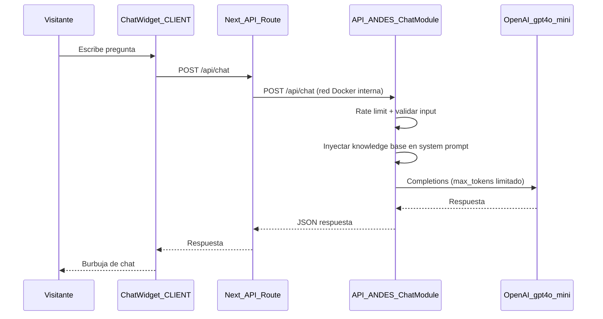

# Plan de implementación: Chatbot FAQ público — Andes Workforce

**Fecha:** 22 de junio de 2026  
**Estado:** Pendiente de implementación  
**Proyectos involucrados:** [API-ANDES](../API-ANDES) · [CLIENT-ANDES](../CLIENT-ANDES)  
**Infraestructura:** Ubuntu · Docker · Traefik  

---

## Resumen ejecutivo

Se propone implementar un **chatbot de preguntas frecuentes (FAQ) público** en el sitio web de Andes Workforce, visible para visitantes sin necesidad de iniciar sesión. El asistente responderá consultas generales sobre la empresa, sus servicios, el proceso de contratación y cómo contactar al equipo.

La solución recomendada es un **módulo propio** integrado en el stack actual (NestJS + Next.js) con **OpenAI GPT-4o-mini**, una base de conocimiento estática y sin contenedores Docker adicionales. El costo operativo estimado es de **$2–15 USD/mes** según el volumen de conversaciones.

---

## Objetivo y alcance

### Objetivo

Ofrecer soporte informativo inmediato en la web pública, reduciendo la fricción para visitantes que buscan información sobre Andes Workforce antes de contactar o postular.

### Alcance del MVP

| Incluido | No incluido (fases futuras) |
|----------|----------------------------|
| FAQ público sin login | Consultas de datos personales (postulaciones, contratos) |
| Respuestas en inglés y español | Asistente autenticado multi-rol |
| Widget flotante en páginas públicas | Streaming de respuestas (SSE) |
| Derivación a contacto y Jira IT | Analytics de conversaciones en base de datos |
| Control de costos con rate limiting | RAG con vector database |

### Relación con soporte existente

El modal de soporte IT ([`ItSupportRedirectModal.tsx`](../CLIENT-ANDES/src/app/components/ItSupportRedirectModal.tsx)) seguirá activo para temas técnicos internos. El chatbot cubre información comercial y general; cuando no tenga certeza, derivará al formulario de contacto o al portal Jira.

---

## Comparativa de opciones evaluadas

| Opción | Costo mensual estimado | Ventajas | Desventajas |
|--------|------------------------|----------|-------------|
| **Propia + GPT-4o-mini** ✅ Recomendada | ~$2–15 USD | Integrada con la UI, clave oculta en backend, sin vendor lock-in | Requiere desarrollo y mantenimiento de la base de conocimiento |
| Widget de terceros (Crisp, Intercom) | $0–29+ USD fijo | Instalación rápida | Menos control visual, planes de pago, datos en terceros |
| Azure OpenAI | Similar a OpenAI | Encaja con ecosistema Microsoft | Más configuración (recurso, deployment, RBAC) sin ahorro real para FAQ |
| RAG + vector DB (Pinecone, etc.) | +$20–70 USD | Escalable para muchos documentos | Excesivo para un FAQ público inicial |

### Decisión

**Chatbot propio + OpenAI API directa + modelo `gpt-4o-mini`**

Motivos principales:

1. **Costo mínimo:** pago por uso; sin suscripción fija mensual a un proveedor de chat.
2. **Seguridad:** la clave de OpenAI permanece solo en el servidor del API; nunca se expone al navegador.
3. **Integración:** reutiliza NestJS, Next.js, JWT, Throttler y Redis ya existentes.
4. **Infraestructura:** no requiere nuevos contenedores Docker ni cambios en Traefik.

---

## Arquitectura

### Diagrama de flujo



### Componentes

| Capa | Tecnología | Responsabilidad |
|------|------------|-----------------|
| UI | Next.js 16 + React 19 + Tailwind | Widget flotante, burbujas de chat, estado local |
| Proxy | Next.js API Route (`/api/chat`) | Reenvío server-side; oculta la clave de OpenAI |
| Backend | NestJS 11 (`ChatModule`) | Validación, rate limit, orquestación LLM |
| IA | OpenAI `gpt-4o-mini` | Generación de respuestas |
| Conocimiento | Archivo estático TypeScript | FAQ curado manualmente |
| Infra | Docker + Traefik + Redis | Sin servicios nuevos; Redis opcional para caché |

### Flujo de red en producción

```
Internet
  └── Traefik (:443)
        ├── andesworkforce.com          → contenedor andes-client:3000
        │     └── POST /api/chat        → proxy interno Next.js
        │           └── http://andes-api:3000/api/chat  (red Docker traefik)
        └── andes.api.andes-workforce.com → contenedor andes-api:3000
              └── OpenAI API (salida HTTPS)
```

- El navegador **solo** comunica con el dominio del cliente.
- El contenedor `andes-client` llama al API por red Docker interna (`INTERNAL_API_URL`).
- La variable `OPENAI_API_KEY` vive **únicamente** en el `.env` del API en el servidor Ubuntu.
- Traefik no requiere cambios: no se expone un servicio nuevo.

---

## Implementación detallada

### Fase 1 — Backend (API-ANDES)

#### Nuevo módulo `chat`

Ubicación: `API-ANDES/src/chat/`

| Archivo | Descripción |
|---------|-------------|
| `chat.module.ts` | Registro del módulo en `app.module.ts` |
| `chat.controller.ts` | Endpoint `POST /api/chat` (público, sin JWT) |
| `chat.service.ts` | Orquestación LLM + base de conocimiento |
| `dto/chat-message.dto.ts` | Validación: mensaje máx. 500 caracteres, historial máx. 6 turnos |
| `knowledge/andes-faq.knowledge.ts` | Contenido estático: servicios, contacto, procesos, enlaces |

#### Dependencia

```bash
pnpm add openai
```

#### Variables de entorno

Agregar en `API-ANDES/.env` (servidor Ubuntu) y documentar en `.env.example`:

```env
# Chatbot FAQ
CHAT_ENABLED=true
OPENAI_API_KEY=sk-...
OPENAI_MODEL=gpt-4o-mini
CHAT_MAX_TOKENS=400
CHAT_RATE_LIMIT_TTL=60000
CHAT_RATE_LIMIT_LIMIT=15
```

| Variable | Descripción | Valor recomendado |
|----------|-------------|-------------------|
| `CHAT_ENABLED` | Activa/desactiva el endpoint sin redeploy de código | `true` |
| `OPENAI_API_KEY` | Clave de API de OpenAI | Secreto en servidor |
| `OPENAI_MODEL` | Modelo a utilizar | `gpt-4o-mini` |
| `CHAT_MAX_TOKENS` | Límite de tokens por respuesta | `400` |
| `CHAT_RATE_LIMIT_TTL` | Ventana de rate limit (ms) | `60000` (1 min) |
| `CHAT_RATE_LIMIT_LIMIT` | Máx. solicitudes por IP por ventana | `15` |

#### Seguridad y control de costos

- Rate limit específico en el endpoint de chat (más estricto que el global de 10 req/min).
- Validación de longitud de mensaje e historial en servidor.
- System prompt con reglas estrictas:
  - Responder solo con información de la base de conocimiento.
  - No inventar precios, contratos ni datos de usuarios.
  - Derivar a `/pages/contact` o Jira IT si no hay certeza.
- Opcional (fase 1.5): caché en Redis para preguntas idénticas frecuentes.

#### Base de datos

**No se requieren tablas Prisma en el MVP.** El historial de conversación vive en memoria del widget del cliente. Esto reduce complejidad y costo de almacenamiento.

---

### Fase 2 — Frontend (CLIENT-ANDES)

#### Componentes del widget

Ubicación: `CLIENT-ANDES/src/components/chat/`

| Archivo | Responsabilidad |
|---------|-----------------|
| `ChatWidget.tsx` | Botón flotante (`fixed bottom-6 right-6`), panel expandible |
| `ChatMessageList.tsx` | Lista con scroll, burbujas usuario/asistente |
| `ChatInput.tsx` | Campo de texto + enviar, deshabilitado durante carga |
| `useChat.ts` | Hook: mensajes, loading, error, limpiar conversación |

**Estilo:** Tailwind CSS con color de marca `--andes-blue: #0097b2` (`globals.css`).

#### Proxy server-side

Archivo: `CLIENT-ANDES/src/app/api/chat/route.ts`

- Recibe `{ messages: [{ role, content }] }` desde el widget.
- Reenvía a `INTERNAL_API_URL` o `http://andes-api:3000/api/` en Docker.
- No expone `OPENAI_API_KEY` al cliente.

#### Montaje global

En `CLIENT-ANDES/src/app/layout.tsx`, junto a `<Toast />`:

```tsx
<ChatWidget />
```

**Visibilidad:** mostrar en páginas públicas (home, about, contact, offers). Ocultar en rutas `/admin/*` y dashboards autenticados mediante `usePathname()`.

#### Experiencia de usuario mínima

- Mensaje de bienvenida: *"Hi! I'm the Andes Workforce assistant. Ask me about our services, hiring process, or how to get in touch."*
- Indicador "typing..." durante la espera.
- Botón para limpiar conversación.
- Fallback ante error de API: enlace a `/pages/contact` y portal Jira IT.

---

### Fase 3 — Despliegue (Ubuntu + Docker + Traefik)

#### API-ANDES

```bash
# En el servidor Ubuntu, dentro de /srv/api-andes (o ruta equivalente)
# 1. Agregar variables OPENAI_* y CHAT_* al .env
# 2. Rebuild y reinicio
docker compose build api
docker compose up -d api
```

No se requieren cambios en las labels de Traefik del `docker-compose.yml` del API.

#### CLIENT-ANDES

Agregar en `docker-compose.yml` o `.env.local`:

```env
INTERNAL_API_URL=http://andes-api:3000/api/
```

```bash
docker compose build client
docker compose up -d client
```

#### Traefik (opcional)

Solo si hay timeouts en respuestas largas (>30 s). Con `max_tokens: 400`, las respuestas suelen tardar 2–8 segundos. En ese caso, añadir middleware de timeout en el router `andes-api`.

#### CI/CD

Los workflows existentes (`.github/workflows/deploy.yml`) siguen funcionando. Asegurar que el `.env` del servidor tenga las nuevas variables **antes** del próximo deploy automático.

---

## Base de conocimiento inicial

Archivo estático: `API-ANDES/src/chat/knowledge/andes-faq.knowledge.ts`

Contenido a incluir (curado manualmente):

- Qué es Andes Workforce (veteran-owned, talento LATAM, BPO, reclutamiento).
- Servicios principales y posicionamiento público.
- Cómo contactar (formulario en `/pages/contact`).
- Proceso general de contratación (sin datos de usuarios).
- Enlaces útiles: portal de empleos, Jira IT para soporte técnico.
- Respuestas bilingües (inglés/español) según el idioma del primer mensaje del usuario.

**Mantenimiento:** editar un único archivo cuando cambie información pública del sitio.

---

## Costos

### Costo de infraestructura adicional

| Concepto | Costo adicional |
|----------|-----------------|
| Contenedores Docker nuevos | **$0** — se reutilizan `andes-api` y `andes-client` |
| Traefik / red Docker | **$0** — sin cambios de routing |
| Base de datos (PostgreSQL) | **$0** — sin tablas nuevas en MVP |
| Redis (caché opcional) | **$0** — ya incluido en el compose del API |

### Costo de OpenAI (gpt-4o-mini)

Precios de referencia OpenAI (junio 2026, sujetos a cambio):

| Tipo | Precio aproximado |
|------|-------------------|
| Input (entrada) | ~$0.15 / 1M tokens |
| Output (salida) | ~$0.60 / 1M tokens |

**Supuestos por conversación FAQ típica:**

- System prompt + KB: ~800 tokens de entrada
- Historial (3 turnos): ~400 tokens de entrada
- Pregunta del usuario: ~50 tokens
- Respuesta del asistente: ~200 tokens de salida
- **Total por conversación:** ~1,250 input + ~200 output ≈ **$0.0003 USD**

### Escenarios mensuales

| Escenario | Conversaciones/mes | Mensajes totales* | Costo OpenAI estimado |
|-----------|-------------------|-------------------|----------------------|
| Bajo | 200 | ~600 | **$0.50 – $2 USD** |
| Medio | 1,000 | ~3,000 | **$2 – $8 USD** |
| Alto | 5,000 | ~15,000 | **$10 – $25 USD** |

\* Asumiendo ~3 mensajes por conversación en promedio.

### Comparativa con alternativas de mercado

| Solución | Costo mensual típico |
|----------|---------------------|
| **Propia + gpt-4o-mini** | $2 – $15 USD (variable) |
| Crisp (plan Pro) | ~$25 USD fijo |
| Intercom (plan Starter) | ~$29 USD fijo + por usuario |
| Chatbase (plan Hobby) | ~$19 USD fijo |
| Azure OpenAI gpt-4o-mini | Similar a OpenAI directo |

### Factores de ahorro incluidos en el diseño

1. Modelo `gpt-4o-mini` (el más económico con calidad aceptable para FAQ).
2. Respuestas cortas (`max_tokens: 400`).
3. Base de conocimiento estática inyectada en system prompt (sin embeddings ni vector DB).
4. Rate limiting por IP para evitar abuso y picos de costo.
5. Sin persistencia en base de datos en MVP.
6. Caché opcional en Redis para preguntas repetidas.

### Costo de desarrollo (referencia interna)

| Fase | Estimación |
|------|------------|
| Backend (ChatModule + KB + env) | 4–6 horas |
| Frontend (widget + proxy + layout) | 6–8 horas |
| Despliegue y pruebas en servidor | 2–3 horas |
| **Total MVP** | **12–17 horas** |

---

## Archivos a crear y modificar

### API-ANDES — Nuevos

```
src/chat/
├── chat.module.ts
├── chat.controller.ts
├── chat.service.ts
├── dto/
│   └── chat-message.dto.ts
└── knowledge/
    └── andes-faq.knowledge.ts
```

### API-ANDES — Modificar

- `src/app.module.ts` — importar `ChatModule`
- `src/config/environments.config.ts` — validar variables `OPENAI_*` y `CHAT_*`
- `.env.example` — documentar nuevas variables
- `package.json` — dependencia `openai`

### CLIENT-ANDES — Nuevos

```
src/components/chat/
├── ChatWidget.tsx
├── ChatMessageList.tsx
├── ChatInput.tsx
└── useChat.ts

src/app/api/chat/
└── route.ts
```

### CLIENT-ANDES — Modificar

- `src/app/layout.tsx` — montar `<ChatWidget />`
- `docker-compose.yml` — agregar `INTERNAL_API_URL`

### Servidor Ubuntu

- `API-ANDES/.env` — agregar `OPENAI_API_KEY` y flags de chat

---

## Checklist de implementación

- [ ] Crear cuenta OpenAI y obtener API key con límite de gasto mensual configurado
- [ ] Implementar `ChatModule` en API-ANDES
- [ ] Crear base de conocimiento `andes-faq.knowledge.ts`
- [ ] Agregar variables de entorno y validación Joi
- [ ] Implementar widget flotante en CLIENT-ANDES
- [ ] Crear API Route proxy `/api/chat`
- [ ] Montar widget en `layout.tsx` (oculto en `/admin/*`)
- [ ] Configurar `INTERNAL_API_URL` en docker-compose del client
- [ ] Agregar variables al `.env` del servidor Ubuntu
- [ ] Rebuild y deploy de contenedores API y Client
- [ ] Probar en producción: pregunta FAQ, rate limit, fallback de error
- [ ] Configurar alerta de gasto en dashboard de OpenAI

---

## Fases futuras (post-MVP)

| Fase | Descripción | Impacto en costo |
|------|-------------|------------------|
| Asistente autenticado multi-rol | JWT + consultas Prisma por rol (candidato/empresa/admin) | Medio (más tokens por contexto) |
| Streaming SSE | Respuestas token a token para mejor UX | Sin cambio de costo |
| Analytics | Tablas Prisma + dashboard de preguntas frecuentes | Solo almacenamiento DB |
| RAG con documentos | Embeddings + vector DB para PDFs y políticas extensas | +$20–70 USD/mes |
| Caché Redis | Respuestas cacheadas para preguntas idénticas | Reduce costo OpenAI |

---

## Referencias internas

- [API-ANDES docker-compose](../API-ANDES/docker-compose.yml)
- [CLIENT-ANDES docker-compose](../CLIENT-ANDES/docker-compose.yml)
- [Traefik — SERVIDOR_DESAROLLO](../SERVIDOR_DESAROLLO/traefik/README.md)
- [Contexto servidor producción](../SERVIDOR_DESAROLLO/CONTEXTO_SERVIDOR_PRODUCCION.md)
- [ItSupportRedirectModal](../CLIENT-ANDES/src/app/components/ItSupportRedirectModal.tsx)
- [axios.server.ts — patrón INTERNAL_API_URL](../CLIENT-ANDES/src/services/axios.server.ts)

---

*Documento generado como guía de implementación. Actualizar tras completar cada fase del checklist.*
